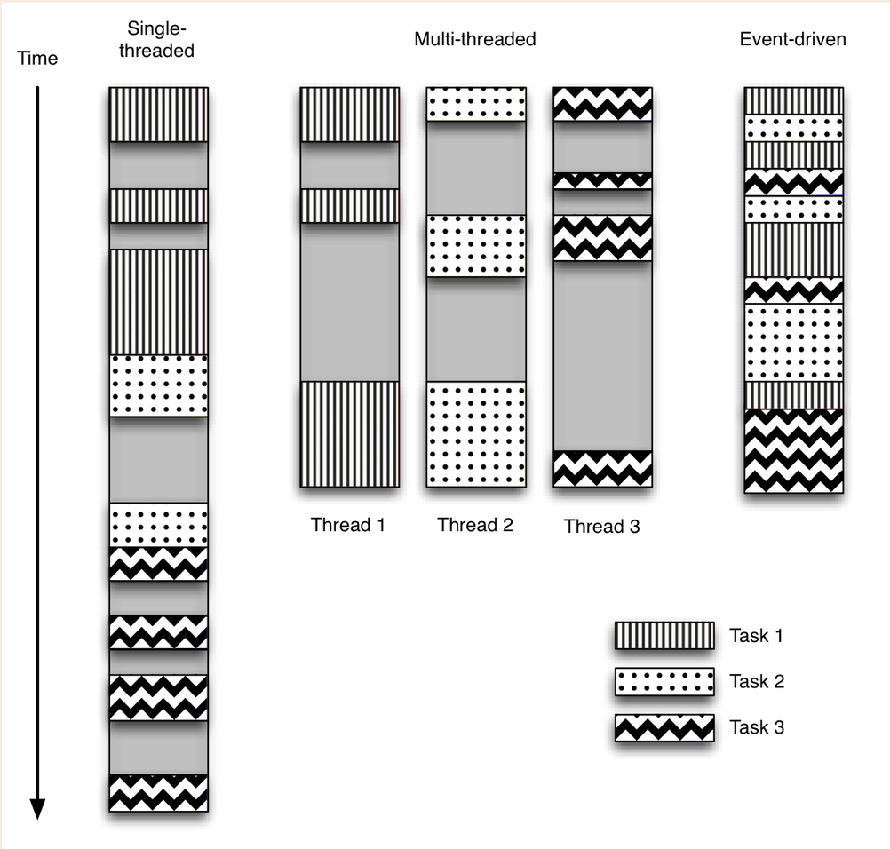
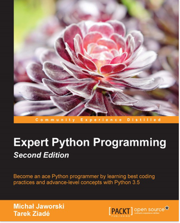
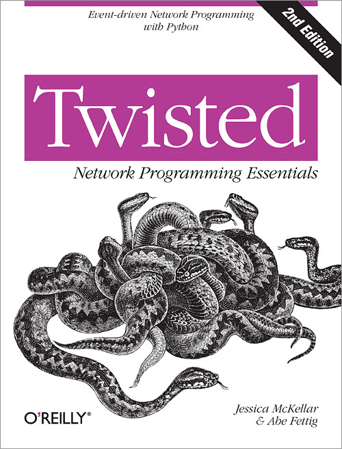

# Python async

<hr />
<h4 class="subtitle">Jeff Stachelski</h4>
<h5 class="subtitle">@jeffhsta</h5>

Note: apresentação

---

## O que é programação assíncrona

---



---

## O que são green threads

---

## Async com Python < 3.5

- Twisted
- Tornado
- Eventlet

---

## Novidades no Python 3.5

----

```python
import asyncio


async def print_number(number):
    print(number)
```

----

```python
import asyncio


def start():
    loop = asyncio.get_event_loop()

    loop.run_until_complete(
      asyncio.wait([
          print_number(number)
          for number in range(10)
      ]))
    loop.close()
```

---

## Fontes

<p class='books-images'>


</p>

---

# Muito Obrigado!

<hr />
<p class="subtitle">https://github.com/jeffhsta/python-async</p>
